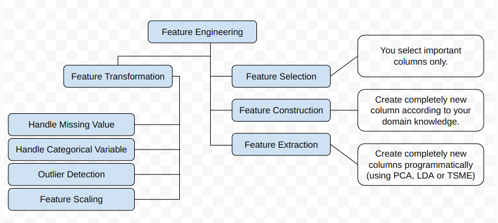

Feature Engineering is the process of using domain knowledge to extract features from raw data.
 These features can be used to improve the performance of machine learning algorithm.

- EDA: Exploratory Data Analysis
- CCA: Complete Case Analysis - removing the observation (data) where values in any of the variables are missing
- MCAR: Missing Completely at Random - you won't lose information while removing rows